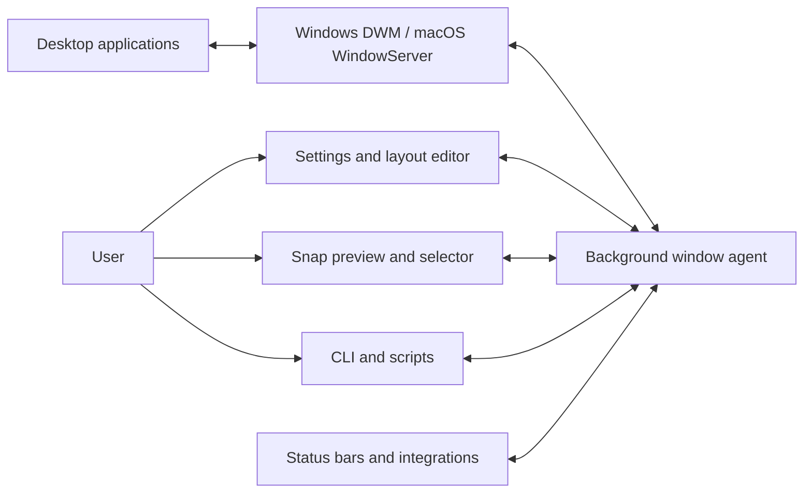
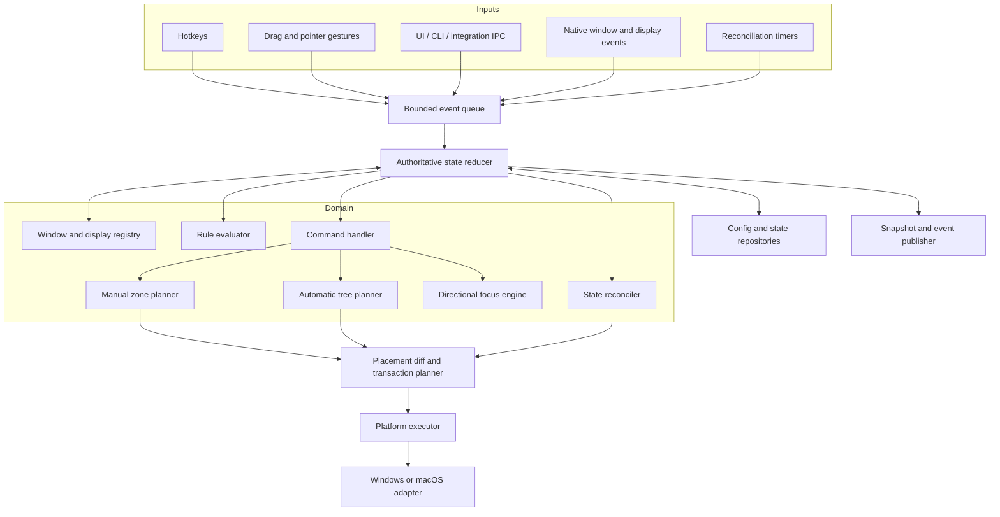
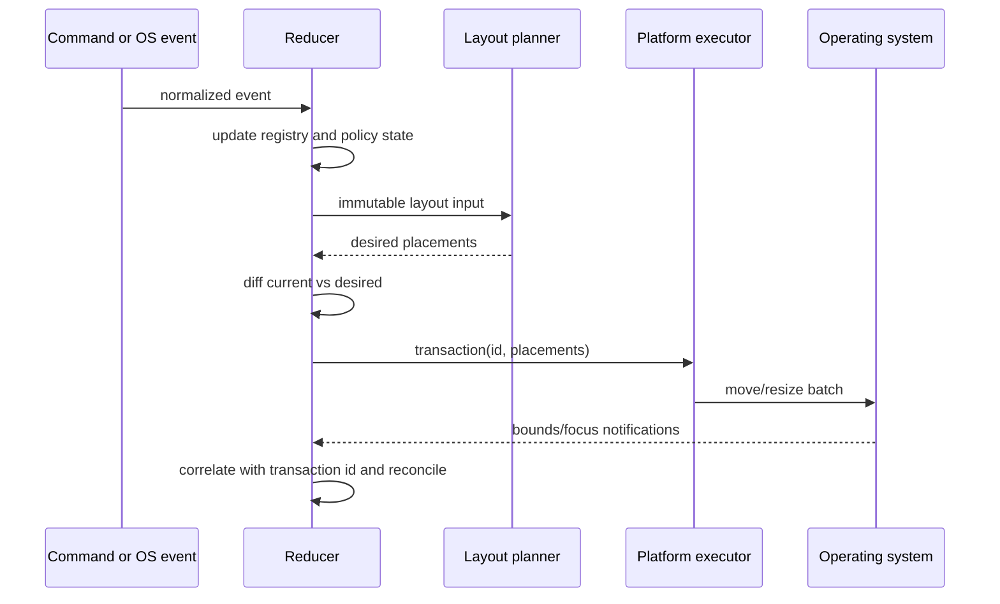

# Cross-Platform Window Tiling Application Architecture

**Status:** Proposed  
**Last updated:** 2026-08-18  
**Target platforms:** Windows 11 and current supported macOS releases  
**Working product name:** Project Tile

## 1. Purpose

This document defines an architecture for a Windows and macOS desktop application that supports:

- Manual window snapping through keyboard shortcuts, drag zones, and an optional radial selector.
- Automatic tiling through tree, column, grid, monocle, and stack layouts.
- Per-monitor layouts and user-defined workspaces.
- Window rules, exclusions, saved arrangements, and workspace restoration.
- A visual layout editor, tray/menu-bar controls, CLI commands, and integrations.

The application augments the native desktop window manager. It does not replace Windows Desktop Window Manager, macOS WindowServer, Explorer, Dock, Mission Control, or native Spaces.

## 2. Research summary

The following representative applications were reviewed. They cover the two main product categories: manual snapping and automatic tiling.

| Application | Platform and style | Architectural or product lesson |
| --- | --- | --- |
| [PowerToys FancyZones](https://learn.microsoft.com/en-us/windows/powertoys/fancyzones) | Windows, manual zones | Treat the layout editor, runtime snap engine, and settings as separate components. Bind layouts to monitor configurations, support overlapping zones and explicit app exclusions, and persist layout data independently of UI state. Microsoft documents a Runner, Editor, Settings, backend library, and dedicated tests in the [FancyZones architecture overview](https://microsoft.github.io/PowerToys/modules/fancyzones/). |
| [Rectangle](https://github.com/rxhanson/Rectangle) | macOS, manual snapping | Make simple actions fast: shortcuts and screen-edge snap areas should resolve into the same move/resize command. Keep the native platform layer small and predictable. |
| [Loop](https://github.com/MrKai77/Loop) | macOS, visual/manual snapping | A radial menu, live placement preview, repeatable action cycles, and URL commands make advanced geometry discoverable without requiring users to memorize many shortcuts. |
| [Amethyst](https://github.com/ianyh/Amethyst) | macOS, automatic tiling | Layout strategies should be swappable. Tall, wide, row, column, monocle, BSP, floating, and custom layouts can share a window inventory and placement pipeline. Custom layouts also justify a stable extension boundary. |
| [AeroSpace](https://nikitabobko.github.io/AeroSpace/guide) | macOS, tree tiling | Represent automatic layouts as normalized workspace trees. Separate floating windows from the tiling tree while still including them in directional focus. Provide commands, callbacks, rules, configuration versions, and a subscribable socket protocol. |
| [yabai](https://github.com/asmvik/yabai/blob/master/doc/yabai.asciidoc) | macOS, BSP and automation | A small daemon plus message-based CLI is highly composable. Private APIs and scripting additions create significant support and security costs, so the default product must stay on public APIs. |
| [komorebi](https://komorebi.lgug2z.com/about/overview/) | Windows/macOS, automatic tiling | Keep a single authoritative manager that reacts to OS events and socket commands. Model monitors containing workspaces, workspaces containing containers, and containers containing one or more windows. Publish state changes to integrations instead of coupling status bars to the engine. |
| [GlazeWM](https://github.com/glzr-io/glazewm) | Windows, i3-style tiling | Human-editable configuration, per-window rules, named workspaces, monitor bindings, commands, gaps, and external status-bar integration are core power-user capabilities rather than afterthoughts. |

### Conclusions from the review

1. Manual snapping and automatic tiling are different policies over the same platform capabilities. They should share discovery, identity, geometry, commands, persistence, and execution, but use different layout state models.
2. The background manager must be authoritative. Settings, overlays, the CLI, and integrations are clients.
3. Event-driven operation is preferable to continuous polling. Periodic enumeration is a recovery mechanism, not the primary event source.
4. The public command protocol is a product feature. It enables hotkeys, a command palette, scripts, status bars, and future plugins without embedding them in the engine.
5. Monitor topology, DPI/scale, transient windows, delayed application startup, and missing OS events are first-class domain problems.
6. macOS private APIs should not be required for the supported feature set.

## 3. Architectural decisions

| Decision | Choice |
| --- | --- |
| Shared implementation language | Rust |
| UI shell | Tauri with a TypeScript UI; use thin native UI only where platform behavior requires it |
| Runtime shape | One background agent plus optional UI and CLI clients |
| Internal consistency | One serialized reducer owns mutable window-manager state |
| OS integration | Native adapter per platform behind a strict capability interface |
| Layout model | Stateless zone plans for manual mode; normalized container trees for automatic mode |
| Persistence | Versioned JSON/TOML user config plus SQLite runtime/state database |
| IPC | Local, authenticated, versioned request/response and event subscription protocol |
| macOS distribution | Signed and notarized direct download, outside the Mac App Store sandbox |
| Extension model | Commands and event subscriptions first; sandboxed layout plugins only after the core is stable |

## 4. System context



The agent is the only component allowed to mutate authoritative tiling state or move third-party windows. Every other component issues commands and consumes snapshots/events.

## 5. Runtime topology

### 5.1 Background agent

Responsibilities:

- Own the OS event hooks and accessibility objects.
- Maintain the authoritative display, workspace, container, and window state.
- Validate and execute commands.
- Calculate placements and apply window transactions.
- Persist state and recover after restart, sleep, crash, or display changes.
- Serve local IPC clients and publish state-change events.

The agent runs at user login. It must remain useful when the settings UI is closed.

### 5.2 Settings and layout editor

Responsibilities:

- Onboarding and permission checks.
- Shortcut, rule, layout, workspace, and appearance configuration.
- Visual editing of grid and canvas zones.
- Window inspector showing identity, capabilities, matched rules, and exclusion reason.
- Diagnostics export.

The editor writes through validated agent commands. It never edits runtime files behind the agent's back.

### 5.3 Overlay process or native overlay module

Responsibilities:

- Draw snap zones while dragging.
- Show the selected placement without committing it.
- Provide an optional radial or command-palette selector.
- Accept pointer interaction without stealing application focus.

Start with the overlay inside the agent process for simpler focus behavior. Split it into a process only if WebView or renderer stability becomes a problem.

### 5.4 CLI

The CLI is a thin IPC client. Example commands:

```text
tile focus left
tile move right
tile snap left-half
tile layout set bsp
tile workspace focus dev
tile window toggle-floating
tile state --json
tile subscribe --json
```

Commands use the same typed command definitions as the UI and hotkey system.

## 6. Logical architecture



## 7. Domain model

### 7.1 Display topology

```rust
struct Display {
    id: DisplayId,
    stable_fingerprint: String,
    full_bounds: Rect,
    work_area: Rect,
    scale_factor: f64,
    rotation: Rotation,
    is_primary: bool,
}
```

`stable_fingerprint` uses the strongest public identifier available, with a documented fallback based on name, geometry, and scale. A topology fingerprint is the sorted set of active display fingerprints plus relevant geometry. Layout profiles bind to this topology rather than to volatile monitor indexes.

### 7.2 Window identity

```rust
struct Window {
    id: WindowId,                 // Ephemeral native handle wrapped by the adapter
    process_id: u32,
    application_id: ApplicationId,// exe identity or macOS bundle ID
    executable_path: Option<PathBuf>,
    title: String,
    native_class: Option<String>,
    role: WindowRole,
    bounds: Rect,
    display_id: DisplayId,
    capabilities: WindowCapabilities,
    lifecycle: WindowLifecycle,
}
```

Native handles must never be persisted as stable identities. Persistent undo and
workspace restoration share one platform-neutral window-identity matcher using
scored evidence:

1. Application identity.
2. Window role/class.
3. Optional safe title pattern.
4. Document identifier when the OS exposes one.
5. Launch order and last-known placement as tie-breakers.

The matcher returns `confident`, `ambiguous`, or `no-match` plus the contributing
evidence and scores. Only `confident` authorizes a persisted placement. The
inspector must expose the same evidence so users can repair rules.

### 7.3 Container tree

```text
Monitor
└── ContainerNode (root)
    ├── ContainerNode (horizontal tiles)
    │   ├── WindowNode
    │   └── WindowNode
    └── ContainerNode (vertical tiles)
        ├── WindowNode
        └── WindowNode
```

The container tree and workspace switching are separate capabilities. Tree-based
tiling initially exposes one visible root per monitor; the model must still allow
a logical workspace to own that root later without changing tree semantics.

Container nodes have:

- Layout: horizontal or vertical tiles in the first container-tree release.
- Child weights.
- Ordered child nodes.
- Gaps and padding inherited from the containing tiling surface.

The first release uses BSP insertion and weighted horizontal/vertical splits. Stack,
monocle, tall/wide presets, and additional policies remain deferred until this tree
ownership, normalization, resizing, persistence, and undo path is proven.

A new tiled window splits the focused tiled leaf into equal-weight siblings along
that leaf's longer geometric axis. If no tiled window is focused, split the largest
leaf and break equal-area ties by visual window order. Explicit insertion direction
and preselection are deferred.

Each tree-resize command shifts the selected split by five percentage points and
reflows every affected live descendant as one undo transaction. Clamp the change
before either affected subtree would violate a live window's minimum size. The step
is fixed rather than configurable in the first release.

Select the closest ancestor split whose axis and sibling position face the requested
resize direction. Climb outward only when the immediate parent has no applicable
divider; if no ancestor qualifies, emit no placement effects.

Directional swap reuses directional focus's spatial neighbor selection. When both
the focused and target windows occupy live, actively arranged tiled leaves, exchange
only their window bindings; preserve all container identities, parentage, split axes,
weights, insertion metadata, and dormant leaves. Logical focus follows the same
window identity into its new leaf, and the resulting placements are one undo
transaction. If either endpoint is floating or in constraint overflow, or no target
exists on the same display, return a structured no-target result without mutating
the tree. Structural directional move and swap behavior for future stack or monocle
containers are deferred and must use separately specified commands.

Tree normalization runs after structural commands:

- Remove empty containers.
- Flatten single-child containers except the root container.
- Merge redundant adjacent containers where semantics allow it.
- Clamp weights to valid, non-zero values.
- Ensure each tiled managed window belongs to exactly one container tree.

On restart, an unmatched persisted window becomes a dormant tree leaf. Dormant leaves
remain in the stored structure but consume no planner space; a later confident
identity match reactivates the prior position. Prune dormant leaves after seven days
unless saved-scene metadata explicitly retains them. Normalization preserves dormant
leaves and the ancestors needed to locate them while removing truly empty structure.

Closing a tiled window also makes its leaf dormant rather than deleting its position.
An explicit remove-position command deletes a dormant leaf immediately and records
the resulting structural reflow as an undo transaction.

When live minimum-size constraints cannot fit, reduce gaps toward zero first. If the
tree still cannot fit, temporarily exclude live leaves from newest insertion to
oldest until the remainder is valid. These constraint-overflow windows remain
visible, managed, and floating without losing their tree positions, and return
automatically when the tree can satisfy them. This state is distinct from a rule or
session-floating choice.

Manual snap mode does not force a window into this tree. A snapped window may remain floating with an optional remembered zone assignment. This prevents manual interactions from unexpectedly turning into automatic rearrangement.

#### 7.3.1 Logical workspace visibility

Logical workspaces form one global pool of unique names. Each owns one container-tree
root, is displayed on at most one monitor at a time, and may move between monitors
without changing identity. Supported tree tiling does not depend on multiple
workspaces or on a mechanism for making non-displayed windows disappear.

Every managed window belongs to exactly one logical workspace, including tiled,
rule-floating, and session-floating windows. Excluded windows remain outside the
workspace system and are never parked or restored by workspace commands.

Create a workspace only through configuration or an explicit `workspace create`
command; command-created workspaces persist in SQLite. Focus, move, and rule targets
must resolve an existing name and return a typed unknown-workspace error on a typo.
Delete a workspace only when it is undisplayed and contains no live or dormant
leaves; otherwise refuse without moving windows or discarding tree state.

Enabling experimental switching requires a resolved configuration that declares
enough uniquely named workspaces to assign one distinct displayed workspace to every
active monitor. Reject activation atomically when that invariant is not met. A
settings flow may offer to create defaults explicitly, but the engine never invents
persistent workspace names.

Only a matched topology profile may enable experimental switching and map workspace
names to displays. Base configuration and unmatched topologies remain ordinary
manual, balanced-grid, or container-tree tiling without workspace parking.

Apply a topology profile's complete workspace-to-display mapping as one atomic
multi-monitor transition. Preflight every affected window and assignment; if any
part cannot commit, preserve the prior mapping on every display rather than exposing
a partially applied profile.

Focusing a hidden workspace displays it on the focused monitor, replacing that
monitor's displayed workspace. If the target workspace is already displayed on
another monitor, focus its last-focused live window there instead of moving the
workspace. Moving a displayed workspace between monitors is a separate explicit
command.

When a rule assigns a newly opened window to a hidden workspace, persist its
membership and recovery record, then park it without changing the displayed
workspace or stealing focus. If the recovery record cannot become durable, leave
the window visible, report the pending assignment, and enter `persistence-degraded`
rather than moving it unsafely.

Track focused display explicitly. Managed-window focus updates it to that window's
display; an explicit display-targeting command also updates it. When no managed
window is focused, retain the last explicitly targeted display so an empty workspace
still has an unambiguous command target. If that display disconnects, select the
nearest surviving display using display-migration geometry and let the primary
display break an exact tie. This supersedes ADR 0020.

When a monitor disconnects, its displayed workspace becomes hidden and its windows
park relative to the nearest surviving display after recovery data is durable.
Workspaces displayed on surviving monitors do not move. Reconnecting a monitor does
not reveal a workspace unless an explicit focus command or resolved topology-profile
preference selects it.

Workspace switching is an experimental adapter capability. It uses only public OS
APIs to park the windows of non-displayed workspaces at reversible edge positions;
it does not control Windows Virtual Desktops or macOS Spaces and must not use
private APIs, process injection, or reduced platform security.

Before activation or switching, the adapter must verify a recoverable parking edge
for the current monitor topology. If none exists, refuse the operation; never fall
back under the same command to minimizing, hiding, or cloaking windows.

Execute switching as a workspace switch transaction. Preflight every live window
and durably commit the recovery ledger before emitting the first parking or restore
effect. If any effect fails, keep the original workspace displayed and compensate
every completed move. Failed compensation publishes `workspace-switch-degraded`,
blocks further switches, and requires the explicit restore action; it does not
mislabel an OS placement failure as `persistence-degraded`.
A successful switch records the previous displayed-workspace assignment and every
affected placement as one persistent undo transaction.

An outgoing managed full-screen window fails switch preflight. Report that window
and leave the displayed workspace unchanged; do not force applications out of
full-screen to make parking possible.

For a maximized window, record its normal geometry and maximized show state, restore
it to normal before parking, and re-maximize it when its workspace is displayed.
Failure to restore or re-maximize is a switch failure and uses the same cancellation
and compensation path.

Leave minimized windows minimized and do not park them merely because their
workspace hides. Preserve their membership, normal restore geometry, and minimized
state. If an application restores a window while its workspace remains hidden,
durably record recovery data and park it immediately; document possible visual
flashing as an experimental limitation.

The experiment requires the SQLite state foundation plus a separate current-session
recovery ledger and out-of-process restore command before it can move a window.
It graduates to a supported feature only after the crash, force-kill, topology,
focus, task-switcher, and application-compatibility matrix in
`docs/research/workspace-feature-strategy.md` passes on both platforms. Failure to
meet that gate leaves switching experimental without blocking container-tree tiling.

On startup, process the previous session's recovery ledger before restoring logical
workspace state. Verify that each native handle still belongs to the recorded process
instance and window evidence, restore verified windows to visible pre-park geometry,
and report rather than touch stale or reused handles. Reconcile durable identities
only after this recovery pass, then reapply saved displayed-workspace assignments as
fresh guarded switch transactions.

### 7.4 Rules

Rules are ordered, explainable, and composable:

```yaml
rules:
  - id: vscode-dev
    match:
      application_id: "com.microsoft.VSCode"
      title_regex: ".*Project A.*"
    actions:
      manage: tile
      workspace: dev
      insertion: after-focused

  - id: browser-pip
    match:
      application_regex: "chrome|edge|firefox"
      title_regex: "(?i)picture.in.picture"
    actions:
      manage: float
      always_on_top: preserve

  - id: dialogs
    match:
      role: dialog
    actions:
      manage: float
```

Rule evaluation returns both actions and a trace containing every matched or rejected condition. Conflicting actions use explicit precedence rather than merge-by-accident.

## 8. Commands, events, and state transitions

### 8.1 Commands express intent

Commands include:

- Focus direction.
- Move or swap in a direction.
- Resize edge or adjust container weight.
- Snap to named zone.
- Set/cycle layout.
- Toggle floating, monocle, or paused mode.
- Focus/move to workspace or display.
- Apply a saved scene.
- Reload configuration.

Commands are validated against a capability snapshot before mutation. The result includes structured success, partial success, or failure details.

### 8.2 Events describe observations

Normalized platform events include:

```text
ApplicationLaunched / ApplicationTerminated
WindowCreated / WindowDestroyed
WindowFocused
WindowBoundsChanged
WindowTitleChanged
WindowMinimized / WindowRestored
MoveResizeStarted / MoveResizeEnded
DisplayTopologyChanged
WorkAreaChanged
SessionLocked / SessionUnlocked
SystemSleeping / SystemWoke
PermissionChanged
```

Platform adapters may emit incomplete events. The reducer therefore treats them as hints and requests a targeted re-read when correctness depends on missing data.

### 8.3 Placement transaction



The executor records expected target bounds and an expiry time. Matching native notifications are correlated with that transaction, not discarded blindly. A short debounce may coalesce bursts, but correctness must not depend on timing alone.

## 9. Layout architecture

### 9.1 Shared interfaces

```rust
trait LayoutPlanner {
    fn plan(&self, input: &LayoutInput) -> Result<PlacementPlan>;
}

trait PlatformAdapter {
    fn capabilities(&self) -> PlatformCapabilities;
    fn enumerate_displays(&self) -> Result<Vec<Display>>;
    fn enumerate_windows(&self) -> Result<Vec<Window>>;
    fn focused_window(&self) -> Result<Option<WindowId>>;
    fn subscribe(&self, sink: PlatformEventSink) -> Result<Subscription>;
    fn apply(&self, transaction: &PlacementTransaction) -> ApplyReport;
}
```

### 9.2 Manual zone planner

The manual planner maps a named action, pointer location, or drag path to one or more normalized rectangles. It supports:

- Grid layouts.
- Free-form canvas zones, including overlaps.
- Margins and inner gaps.
- Cycling among sizes when an action repeats.
- Multi-zone selection.
- Preview without commit.
- Previous-bounds restoration.

### 9.3 Automatic tree planner

The automatic planner maps a normalized workspace tree to rectangles. It supports:

- Horizontal and vertical splits.
- Main-and-stack strategies such as tall and wide.
- BSP insertion.
- Stack/accordion containers.
- Monocle.
- User-adjusted weights.
- Minimum-size-aware degradation.

When constraints make the requested arrangement impossible, the planner returns diagnostics and applies a deterministic degradation policy: reduce gaps, honor minimum sizes, then mark newest inserted windows as constraint overflow until the remainder fits. It must never oscillate endlessly between two arrangements.

### 9.4 Focus engine

Directional focus is geometric, not array-index based. Rank candidates using:

- Candidate lies in the requested half-plane.
- Primary-axis distance.
- Perpendicular overlap and distance.
- Same workspace/display preference.
- Most-recently-focused tie-breaker.

Floating windows participate in focus navigation without becoming tiling-tree children.

## 10. Geometry and coordinate rules

The core uses logical, top-left-origin coordinates. Persisted zones use normalized fractions of a display work area:

```json
{ "x": 0.0, "y": 0.0, "width": 0.5, "height": 1.0 }
```

Only platform adapters convert between core logical coordinates and native coordinate systems.

Rules:

- Windows adapter is Per-Monitor DPI Aware V2 and performs conversions in the target window's DPI context. Microsoft documents that `GetDpiForWindow` depends on the window's DPI-awareness mode: [GetDpiForWindow](https://learn.microsoft.com/en-us/windows/win32/api/winuser/nf-winuser-getdpiforwindow).
- macOS adapter explicitly converts AppKit, Core Graphics, and Accessibility coordinate origins.
- Work areas exclude taskbars, menu bars, and docks.
- Negative desktop coordinates and displays above the primary display are valid.
- Rounding uses one deterministic edge-allocation algorithm so adjacent tiles neither overlap nor leave cumulative gaps.
- Display changes invalidate cached conversions and trigger topology reconciliation.

## 11. Platform adapters

### 11.1 Windows

Primary APIs:

- Enumerate windows/displays with Win32.
- Observe window lifecycle, focus, move/resize, and location events using [`SetWinEventHook`](https://learn.microsoft.com/en-us/windows/win32/api/winuser/nf-winuser-setwineventhook). Its owning thread must run a message loop.
- Move/resize top-level windows with `SetWindowPos`/deferred positioning.
- Use per-monitor DPI-aware APIs for geometry.
- Register supported global hotkeys; isolate any low-level keyboard hook behind an optional input module.
- Treat [`IVirtualDesktopManager`](https://learn.microsoft.com/en-us/windows/win32/api/shobjidl_core/nn-shobjidl_core-ivirtualdesktopmanager) as an optional capability rather than a core dependency.

Security boundary:

Windows User Interface Privilege Isolation restricts interaction across integrity levels. Version 1 should run unelevated and report elevated windows as unsupported. A later UIAccess mode requires a signed application, protected installation location, and separate threat review. See [Microsoft UI Automation security considerations](https://learn.microsoft.com/en-us/windows/win32/winauto/uiauto-securityoverview).

### 11.2 macOS

Primary APIs:

- Discover and manipulate application windows through public Accessibility APIs represented by [`AXUIElement`](https://developer.apple.com/documentation/applicationservices/axuielement_h).
- Subscribe to per-application notifications with [`AXObserver`](https://developer.apple.com/documentation/applicationservices/1460133-axobservercreate).
- Check and prompt for accessibility trust with [`AXIsProcessTrustedWithOptions`](https://developer.apple.com/documentation/applicationservices/1459186-axisprocesstrustedwithoptions).
- Use AppKit/Core Graphics for displays, overlays, menu-bar UI, and current-session window metadata.

Security and distribution boundary:

Apple documents accessibility APIs in assistive apps as incompatible with App Sandbox. Because sandboxing is required for Mac App Store distribution, ship a signed, hardened, notarized direct-download app. See [Protecting user data with App Sandbox](https://developer.apple.com/documentation/security/protecting-user-data-with-app-sandbox).

Private APIs, Dock injection, and requiring users to weaken System Integrity Protection are outside the supported architecture. AeroSpace documents that Apple does not expose a public API for full Spaces manipulation, while yabai demonstrates the maintenance burden of scripting additions. Native Spaces control must therefore be capability-gated and excluded from the initial product.

## 12. Persistence

### 12.1 Human-editable configuration

Use a versioned TOML or YAML file for:

- Hotkeys and input modes.
- Named layouts.
- Rules and exclusions.
- Workspace-to-monitor preferences.
- Gaps, padding, focus policy, and behavior flags.
- Startup, reload, and workspace-change commands, if enabled.

Configuration reload is atomic:

1. Read into a candidate model.
2. Validate schema and semantics.
3. Compile regexes and bindings.
4. Reject the entire candidate with line-aware errors, or swap it into the reducer.
5. Publish `ConfigurationChanged` only after success.

### 12.2 SQLite state database

Use `rusqlite` with bundled SQLite behind a dedicated persistence worker. The
serialized reducer sends committed records to that worker and never executes SQL or
holds a database connection directly. The worker applies writes in reducer-revision
order and owns migrations, transactions, retention pruning, and database health.

If a database write fails after live effects have committed, do not attempt to move
windows back. Continue managing them from in-memory state, publish a visible
`persistence-degraded` health condition, reject new workspace-parking actions, and
stop claiming that new undo transactions are durable until ordered writes recover.

If the database is corrupt, its schema is newer than the running application, or a
migration fails at startup, preserve the database untouched and start in
`persistence-degraded` mode. Never replace, downgrade, or reset it automatically;
repair and reset are explicit user actions.

The first release does not add application-level database encryption. Store the
database in the platform's per-user application-data directory with user-only file
access, and minimize sensitive persisted evidence. Revisit encryption only against
a threat model that justifies cross-platform key management.

Use SQLite for:

- Last-known topology and workspace trees.
- Window placement history and undo data.
- Saved scenes/workspace restoration metadata.
- Schema migrations.
- Permission/onboarding state.
- Bounded diagnostic events, if the user enables diagnostics.

Introduce schemas only with a live consumer. The first SQLite milestone contains
schema-version/migration metadata, database-health support, and persistent-undo
records; container-tree, scene, diagnostics, and onboarding tables arrive with
their owning features rather than as speculative placeholders.

Persist undo at the user-visible command boundary: every reversible state change and
placement produced by one grid reflow, saved-layout application, or workspace action
belongs to one undo transaction and is reversed as a unit. Undo preflights every member; if any target
is missing, ambiguous, or below the confidence threshold, the complete transaction
is refused before any placement effect is emitted.

Retain at most the newest 100 undo transactions and prune every transaction older
than seven days; whichever bound is reached first applies. These bounds are fixed
for the first release rather than user-configurable.

Only an explicit placement-changing user command creates an undo transaction. When
that command triggers a grid reflow, all resulting placements join the same
transaction. Passive reflows caused by window lifecycle, application state, or
display topology events are not undoable because Mosaix cannot reverse their cause.

Each transaction records its display-topology fingerprint. Undo requires the current
fingerprint to match exactly; a mismatch refuses the transaction and retains it for
retry until the original topology returns or the retention policy prunes it.
The undo command considers only the newest transaction: if that transaction cannot
be applied, it reports the reason and never silently skips to an older action.
A successful undo consumes that transaction. The first release stores no redo
history; persistent redo is deferred to issue #44.

An undo refusal is a typed IPC result containing the transaction identifier, a
machine-readable reason, and per-target matching evidence sufficient for the CLI to
explain the failure. The full graphical evidence and repair inspector remains part
of identity-based scene restoration in issue #28. Undo exposes no force or
best-guess override; only repairing the evidence can turn a refusal into an
applicable transaction.

Do not store native window handles across sessions. Persistent undo resolves targets
from scored identity evidence after restart; an ambiguous or low-confidence match is
reported and left unapplied rather than moved speculatively. Persistent undo does
not capture raw window titles by default; it relies on application identity,
role/class, safe document identifiers, launch order, and last placement. A title
pattern may participate only when the user deliberately supplies it through the
identity-repair workflow. Do not store window titles by default in diagnostic logs
because they may contain document names or private information.

## 13. IPC and extension boundary

Use a local transport:

- Windows: named pipe restricted to the current user's security identifier.
- macOS: XPC or a user-only Unix domain socket.

Protocol properties:

- Explicit protocol version and capability negotiation.
- Typed request/response commands.
- Full state snapshot request.
- Monotonic state revision on every committed mutation.
- Subscriptions that deliver `{revision, cause, patch}`.
- Bounded subscriber queues with a resync-required signal on overflow.
- Message-size and rate limits.
- No network listener.

The first extension surface is the CLI plus read-only event subscriptions. In-process third-party plugins are deferred because they would share accessibility/window-control privileges with the agent. Future custom layout code should execute in a restricted WebAssembly runtime with time and memory limits and receive immutable layout input only.

## 14. Concurrency and recovery

### 14.1 Concurrency model

- Native adapter threads translate callbacks into normalized events.
- A bounded multi-producer queue feeds one reducer task.
- The reducer is the only writer of domain state.
- Layout calculations operate on immutable snapshots and may run off-thread.
- A placement result is committed only if its input state revision is still current.
- Persistence and subscriber delivery are asynchronous but ordered by revision.

This eliminates most shared-state locks and makes event traces replayable in tests.

### 14.2 Reconciliation

Reconciliation runs:

- At startup.
- After wake/unlock.
- After display topology changes.
- After permission recovery.
- When an adapter reports event loss or queue overflow.
- At a low-frequency safety interval.

It enumerates observed OS state, diffs it against the registry, synthesizes missing lifecycle events, then produces one stable placement plan. Exponential backoff handles applications whose accessibility trees are not ready immediately after launch.

### 14.3 Failure isolation

- One unresponsive application must not block the reducer; native calls have deadlines where possible.
- Repeated failures trip a per-window circuit breaker and mark the window temporarily unmanaged.
- Invalid configuration preserves the last known good configuration.
- A crashing UI does not stop window management.
- Startup crash loops enter safe mode with automatic tiling paused but settings and diagnostics available.

## 15. User experience architecture

### 15.1 Onboarding

1. Explain the exact permission needed and why.
2. Check platform capability and accessibility trust.
3. Offer a safe demo using the application's own window.
4. Select manual, automatic, or hybrid mode.
5. Install a minimal non-conflicting shortcut set.
6. Show how to pause management immediately.

### 15.2 Essential surfaces

- Tray/menu-bar status with pause, mode, current layout, and settings.
- Layout editor with per-topology preview.
- Rule builder plus live window inspector.
- Shortcut conflict detector.
- Permission health and unsupported-window explanation.
- Diagnostics view with sanitized event trace.
- Command palette or radial selector for discoverability.

Every move operation should be undoable for a short bounded history. Manual user movement temporarily overrides automatic placement until move/resize ends and the configured policy decides whether to adopt, float, snap, or retile the window.

## 16. Repository structure

```text
project-tile/
├── Cargo.toml
├── crates/
│   ├── tile-domain/            # IDs, geometry, state, commands, events
│   ├── tile-layout/            # Zones, trees, strategies, normalization
│   ├── tile-rules/             # Matching, precedence, explanations
│   ├── tile-engine/            # Reducer, reconciliation, transactions
│   ├── tile-config/            # Schema, validation, migrations
│   ├── tile-ipc/               # Protocol and local transports
│   ├── tile-platform-api/      # Adapter traits and capability model
│   ├── tile-platform-windows/  # Win32 implementation
│   ├── tile-platform-macos/    # Accessibility/AppKit implementation
│   ├── tile-agent/             # Background executable
│   └── tile-cli/               # Command-line client
├── apps/
│   └── tile-settings/          # Tauri/TypeScript UI
├── schemas/                    # Config and IPC schemas
├── fixtures/                   # Event traces and topology fixtures
├── tests/
│   ├── contract/
│   ├── replay/
│   └── platform/
└── docs/
    ├── architecture-decisions/
    ├── permissions/
    └── troubleshooting/
```

If macOS bindings become brittle, `tile-platform-macos` may contain a thin Swift static library. Native types still terminate at the adapter boundary.

## 17. Testing strategy

### 17.1 Pure domain tests

- Golden tests for every layout and topology.
- Property tests: bounds remain inside work areas, managed windows are assigned once, weights normalize, and output is deterministic.
- Tree command and normalization tests.
- Rule precedence and explanation tests.
- Directional focus tests.
- Rounding tests across scales and negative coordinates.

### 17.2 Recorded event replay

Record sanitized normalized event traces for difficult scenarios and replay them deterministically:

- Window opens and closes during a retile.
- Browser changes a window from splash/dialog to normal.
- Display is unplugged during drag.
- Laptop wakes with a different monitor order.
- Events arrive duplicated, late, or missing.
- An application rejects its requested size.

### 17.3 Adapter contract tests

Every adapter must pass the same behavioral suite for enumeration, focus, placement, move/resize correlation, unsupported windows, and topology refresh.

### 17.4 Platform integration matrix

- Mixed 100/125/150/200 percent Windows display scaling.
- Retina and non-Retina macOS displays.
- Displays left of, right of, and above the primary display.
- Auto-hidden taskbar/Dock and menu-bar changes.
- Minimized, maximized, full-screen, modal, tool, picture-in-picture, and non-resizable windows.
- Explorer/Finder, Chromium, Firefox, Electron, Office, JetBrains, terminals, and native sample apps.
- Sleep/wake, lock/unlock, remote desktop, fast user switching, and permission revocation.

## 18. Performance targets

Initial engineering targets, measured on supported mid-range hardware:

- Hotkey-to-placement command accepted: under 25 ms at p95.
- Preview update during drag: under 16 ms at p95, with rendering degraded before input handling.
- Focus command to native focus request: under 50 ms at p95.
- Ordinary OS event to stable layout plan: under 100 ms at p95.
- Idle CPU: below 0.5 percent after settling.
- Bounded normal-operation memory for the agent: target below 100 MB.
- Startup to active event subscription: under 1 second, excluding permission prompts.

These are budgets, not guarantees. Measure before using them as release criteria.

## 19. Security, privacy, and updates

- Run with standard user privileges.
- Never inject code into other processes.
- Do not require reduced SIP or private macOS frameworks.
- Bind IPC to the current local user only.
- Validate all CLI/IPC inputs and configuration regexes.
- Sign Windows binaries and macOS bundles; notarize macOS releases.
- Use signed update manifests and atomic rollback-capable updates.
- Collect no telemetry by default. Crash reporting and diagnostics are explicit opt-in.
- Redact window titles, document paths, typed keys, and application arguments from logs.
- Make the pause/quit state obvious and immediately effective.

## 20. Delivery plan

### Phase 0: Platform spikes

- Enumerate and move normal windows on both platforms.
- Verify event delivery, focus behavior, coordinate conversion, and permission onboarding.
- Build a topology test harness before committing to UI technology.

### Phase 1: Manual snapping MVP

- Agent, adapter interface, reducer, IPC, and CLI.
- Focused-window halves, quarters, thirds, center, maximize, restore, and next-display commands.
- Global shortcuts and basic preview overlay.
- Per-monitor topology profiles and pause mode.
- Direct-download signed development builds.

### Phase 2: Product-quality zones

- Grid/canvas layout editor.
- Drag-to-snap and multi-zone selection.
- Rules, exclusions, inspector, undo, config reload, and diagnostics.
- Robust reconciliation, sleep/wake, and display-change handling.

### State foundation

- SQLite schema migrations, database health, and transactional state access.
- Persistent undo and the placement/identity evidence it consumes.
- Container-tree, onboarding, scene, and optional diagnostic schemas added only with their consuming features.
- A separate current-session native-window recovery ledger and out-of-process repair command.

### Phase 3A: Container-tree tiling

- Normalized container tree over one visible root per monitor.
- Weighted horizontal/vertical splits with BSP insertion.
- Directional focus, swap, resize, insertion policy, and tree normalization.
- External state subscriptions and status-bar integrations.

Deferred tree policies include stack, monocle, tall, wide, rows, and columns.

### Phase 3B: Experimental logical workspace switching

- Named logical workspaces, each owning one container-tree root.
- Public-API window parking with explicit limitations and restore controls.
- Graduation only after the cross-platform recovery and compatibility matrix passes.

### Phase 4: Saved scenes and automation

- Application launching and asynchronous workspace restoration.
- Versioned scene matching with partial-success reporting.
- URL scheme, command palette/radial selector, and lifecycle callbacks.
- Optional Windows virtual-desktop integration where public APIs suffice.

### Phase 5: Safe extensibility

- Read-only SDK generated from the IPC schema.
- Sandboxed custom layout modules.
- Compatibility policy and plugin API versioning.

## 21. Explicit non-goals for version 1

- Replacing the native desktop compositor or shell.
- Full control of macOS Spaces.
- Private APIs, process injection, or reduced System Integrity Protection.
- Managing secure desktops, login windows, system prompts, or elevated Windows applications.
- Capturing window contents or requesting screen-recording permission for thumbnails.
- Synchronizing layouts through a cloud service.
- Running untrusted extensions inside the privileged background agent.

## 22. Principal risks and mitigations

| Risk | Mitigation |
| --- | --- |
| OS events are missing, duplicated, or reordered | Serialized reducer, event correlation, targeted reads, and periodic reconciliation |
| Applications expose unusual or delayed window metadata | Capability probes, retries with backoff, rule inspector, and per-window circuit breakers |
| Mixed-DPI geometry drifts | Strict adapter-boundary conversion and topology/rounding test matrices |
| Manual movement fights automatic tiling | Explicit move/resize session state and configurable adopt/float/snap/retile policy |
| macOS permission becomes stale after updates/signing changes | Stable signing identity, permission health checks, onboarding recovery, and direct notarized distribution |
| Feature parity encourages private APIs | Capability matrix; unsupported features degrade explicitly instead of silently using private APIs |
| UI or integration destabilizes the manager | Authoritative headless agent and versioned IPC boundary |
| Configuration becomes inaccessible to mainstream users | GUI editor backed by the same versioned schema, plus human-editable config for power users |
| State database becomes unavailable after a live placement | Continue in memory, surface persistence-degraded health, and gate parking and new durability promises until ordered writes recover |

## 23. Architecture acceptance criteria

The architecture is ready for implementation when:

- Platform spikes prove reliable enumerate, focus, move, resize, and event observation on both systems.
- The coordinate model passes mixed-monitor fixtures.
- Command, event, adapter, and IPC types have versioned schemas.
- Manual and automatic layout planners are demonstrably isolated from native APIs.
- The reducer can replay a recorded event trace deterministically.
- Permissions, distribution, and unsupported-feature behavior are documented and tested.
- UI, CLI, and overlays can all execute the same command definitions.

## 24. Open product decisions

These do not block the platform spikes, but should be resolved before the Phase 1 UX is frozen:

1. Is the default experience manual snapping, automatic tiling, or a first-run choice?
2. Is a radial selector a primary interaction or an optional advanced surface?
3. Should saved scenes launch applications, or only arrange windows that already exist?
4. Which macOS versions and Windows editions form the initial support matrix?
5. Is configuration portability across operating systems a core promise? If so, platform-specific actions need explicit fallbacks.

The workspace-emulation decision is resolved by ADR 0023.
